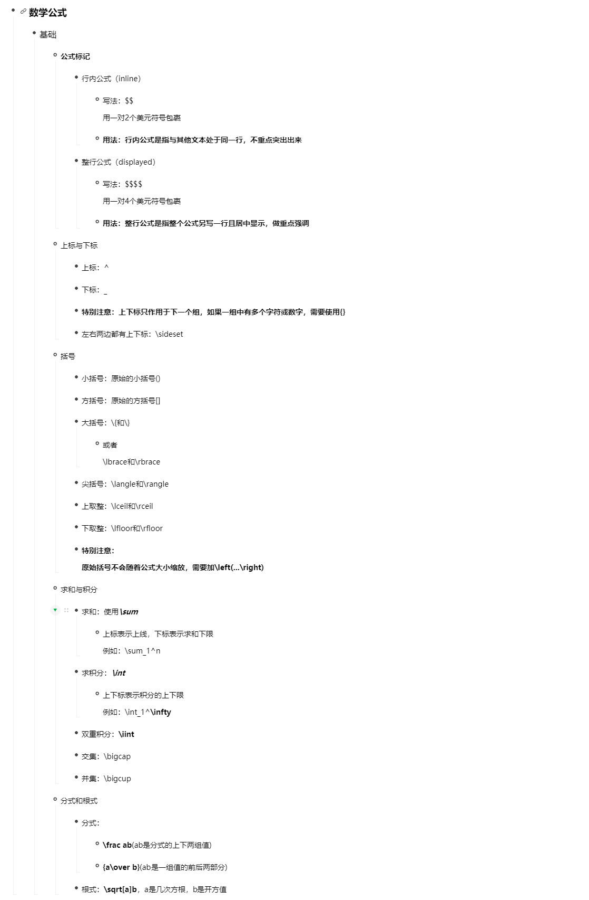

### Markdown简介
1. markdown是轻量级标记语言，支持易读易写的纯文本格式编写文档，然后有效的转化为XHTML或HTML文档。
2. markdown文档文件的.md 或 .markdown
3. markdown语法的编辑器：typroa 或 Vscode
> Vscode下载插件：Markdown Preview Enhanced ; 设置Ctr+shift+p：Markdown: Open Preview to the Side
4. MarkDown学习网站：
* [基础语法](https://markdown.com.cn/basic-syntax/)
* [扩展语法](https://markdown.com.cn/extended-syntax/)
### Markdown标题语法  
1.井号（#）：
```
# 表示第一级标题 ---> <h1></h1>
## 表示第二季标题 ....
### 表示第三级标题....
........
###### 表示第六级标题---><h6></h6>
```
注意：井号(#)和标题之间有一个空格  
2.== 号：在标题下方使用若干==（对应一级标题）；若干-----号（对应二级标题）
### Markdown段落
    创建段落，用一行或多行空白行将文本进行分隔
    注意：不要使用空白格和制表符进行缩进
### Markdown换行语法
    1.文本结尾加两个空格和回车键
    2.文本结尾加
    表示换行
### Markdown强调语法（对链接无效）
    1.粗体：**强调主体**
    2.斜体：*斜体对象*
    3.粗斜体：***粗斜体对象***
### Markdown引用语法
    1.引用文本前加：>
    2.多段落块引用：
                > 内容1
                >
                > 内容2
    3.嵌套块引用：
                > 内容1
                >
                >>内容2
    4.带有其他元素的引用：
                > ####
                > -
                > -
                > *内容*
### Markdown列表语法
    1.有序列表：每列项前用数字和点号紧密连接在一起如1.  2.等等；注意：数字必须以1开始，但不必保持顺序。
    2.无序列表： 每个列表项前面添加破折号 (-)、星号 (*) 或加号 (+) 。注意：不要混合使用- * +这几个符号。
### Markdown代码语法
    1.单词或短语设置为代码，使用反引号（`）；
    2.转义反引号：代码中需要包含一个或多个反引号，则需要使用双反引号（``）
    3.创建代码块：每个代码块至少缩进4个单元格或1个制表符；
### Markdown代码块语法
    1.``` code code code ```
### Markdown分隔符语法
    单独一行使用三个或多个星号（***）、破折号（---）、或下划线（___）并且不能包含其他内容。
    注意：为了兼容性，可以在分隔符前后添加空白行。
### Markdown表单
    使用|分隔列内容，使用-和:定义对齐方式和表头
    示例第一行（标题）：|列1|列2|
    示例第二行（表头）：|---|---|
    示例第三行（内容）：|值1|值2|
### 图片
    
### 链接
    [](链接地址)
## 扩展内容
### 
    