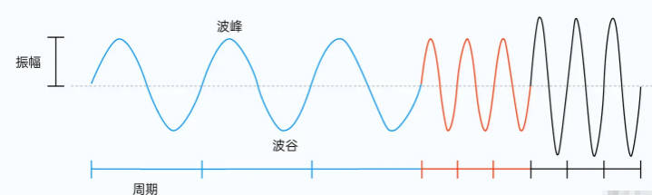
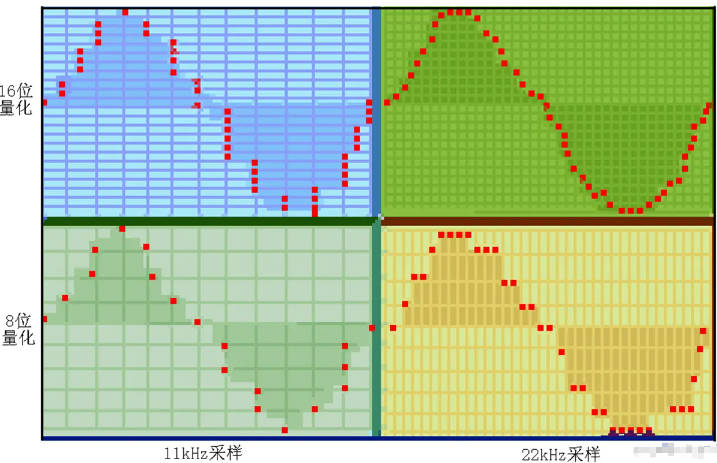

## 音频知识
> 重点：音频本身的音量（响度（dB））不会随着播放器音量的改变而改变；播放器音量的大小不是指播放的音频一直保持在该音量上，而是表示输出音量设置在某个水平。
### 1.声音三要素：音调、响度、音色
在物理定义上，声音是物体振动产生的波，例如人声是由人的声带振动产生的波；重点：音调由基音决定，而音色主要取决于泛音
* 音调：是对声音高低的感觉的描述；定义由发声体的振动频率决定，振动频率越高，音调越高，听起来就越刺耳；反之，音调越低，听起来就越低沉。
    * 一般人声带振动频率在：100hz-10khz之间；
    * 而人听力接受范围：20hz-20khz之间；
    * 低于20hz，称为次声波；高于20khz，称为超声波。
* 响度：对声音强弱的感觉描述；是由发声体振动的幅度决定的；相同距离，振动幅度越大，声音越响；反之，声音越弱
* 音色：对各种音调、各种响度声音的综合感受；
    * 物体整体振动发出的声音为基音；
    * 其各部分还有复合的振动，发出的声音，称为泛音，在物理上称为谐波；
    * 音色一般由发声体的材质决定的。
### 2.波形图

* 周期（T）：两个相邻的波峰或波谷在时间轴上的水平距离
* 频率（f）：周期的倒数即为频率，单位是s/1，也称为赫兹HZ；
* 振幅：波峰和波谷在竖直方向上的一半
### 3.音频信号数字化
主要方案—— 脉冲编码调制PCM
1. 声音采集：声音可以被麦克风等设备采集，转换为电学模拟信号。模拟信号：在时间维度和幅度维度都是连续的，可以被无限分隔为任意小点的。而计算机只能识别数字信号（离散、有限个、可穷举）；
2. 音频模拟信号的数字化：将音频模拟信号转换为音频数字信号；
    * 采样：按照固定的时间间隔T，依次选取多个点，T为采样周期，采样率f=1/T(单位Hz)，采样率f表示每秒钟进行采样的次数。
    * 量化：在幅度方向上，进行数字化，得到每个采样点的幅度值，也叫位深；
    * 编码：将十进制的幅度值转化为二进制的幅度值，也称离散的数字信号，是未经压缩的音频采样数据裸流，也叫PCM音频数据（脉冲编码调制）
### 4.数字信号质量三要素
* 采样率： 单位时间内（1s）对声音信号的采样次数；
    * 奈奎斯特频率：采样率f必须大于原始音频信号最大振动频率fmax的2倍，才能完整重建原始音频信号；
    * 8、16、32khz采样率，用于通信场景
    * 44.1khz采样率，一般作为CD音质的采样标准
* 采样位深：采样点幅度值的取值精度为bit， 位深影响声音的解析精度、细腻程度，我们可以将其理解为声音信号的“分辨率”，位深越大，音色也越真实、生动。
    * 表示用多少二进制位数去存储一个样本点的采样值
    
    * 常见设备采样位深：CD为16bit，DVD为24bit，电话为8bit
* 声道数：1，2，4，8声道
### 5.音频编解码
PCM数据是未经压缩的原始数据，
1. 音频编码：将PCM数据，按照某种编码格式进行编码压缩，再存入某种文件格式的文件中。
    * 无损压缩
        * 体积大，压缩比小
        * 解压后可还原原始音频数据
    * 有损压缩
        * 体积小，压缩比大
        * 解压后无法完全还原原始音频信息
2. 音频解码：将某种音频格式文件解码，还原成PCM数据
### 6.音频文件格式
1. 音频编码：
    * 无损编码：
        * Monkey's Audio：音频编码和文件格式，后缀：.ape
        * FLAC:音频编码和文件格式，后缀：.flac
        * ALAC：音频编码，文件后缀：.m4a，.caf
    * 有损编码：
        * MP3：音频编码和文件格式，后缀：.mp3
        * WMA：音频编码和文件格式，后缀：.wma
        * AAC：音频编码和文件格式，后缀：.aac、.mp4、.m4a
        * Vorbis：音频编码，后缀：.ogg
2. 文件格式：
    * ogg，多媒体格式，音视频都可存储
    * wav：音频文件格式，用于存储PCM编码
    * aiff：音频文件格式，存储PCM编码
